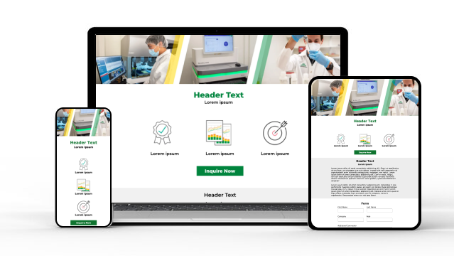
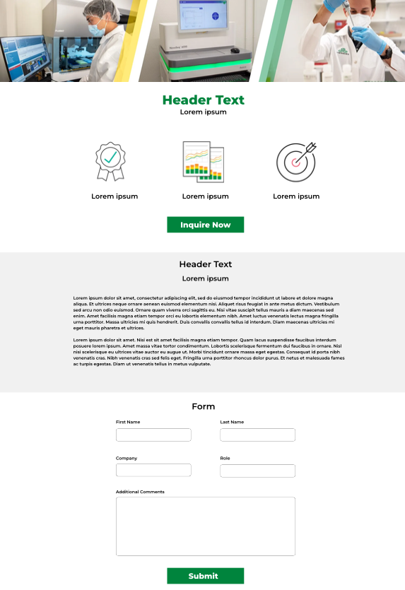

# Zymo Research Landing Page

  

## Live Site

Check out the [live site here](https://kathleenmerc.github.io/zymo-research-assignment/).

## Table of Contents

- [Objective](#objective)
- [Requirements](#requirements)
- [Plan](#plan)
- [Features](#features)

## Objective

As a front-end web developer, the goal was to build a new landing page based on a design mock. 

The page includes:
- Hero section with prominent headings and a call-to-action button
- 'About' section with titles and text
- Contact form with input fields and a submit button

Image of Design Mock:

  

## Requirements

- Use HTML, CSS, and JavaScript.
- Create a responsive design for various devices and screen sizes.
- Include a hero section with a call-to-action button that scrolls to the contact form.
- Implement a contact form with input fields and a submit button.
- Use appropriate HTML semantic elements.
- Apply CSS styles for a visually appealing layout.
- Implement JavaScript functionality for form submission and interactivity.

## Plan

- Design screens for mobile, tablet, and desktop.
- Start building with a mobile-first and top-down approach.
- Add responsiveness using media queries for larger screens.
- Refine styling and add CSS animations and effects.
- Refactor and organize code for better readability by applying DRY principles and coding best practices.
- Create README.md file.
- Deploy on GitHub Pages.

## Features

- Form Validation and Successful Submission Modal for better user experience
- Media Queries and Smooth Scrolling for website responsiveness
- Animations implemented with CSS keyframes and JavaScript Intersection Observer
- CSS Flexbox and Grid
- DOM Manipulation and Event Listeners
- CSS hover styling for buttons

